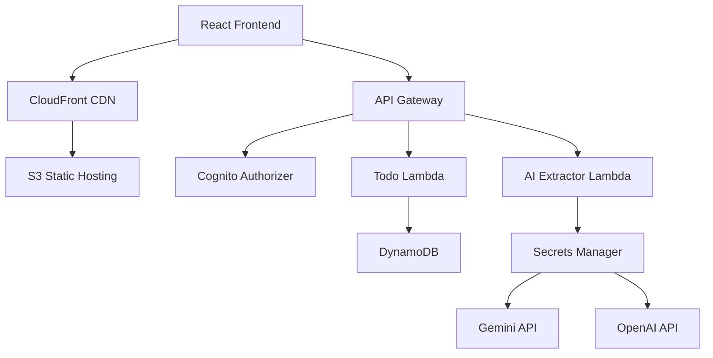

# TaskFlow AI - Next-Generation Todo Management

🤖 **AI-Powered Task Extraction** | 🎨 **Modern Glassmorphism UI** | ☁️ **Cloud-Native Architecture**

TaskFlow AI is an intelligent todo management application that leverages artificial intelligence to automatically extract actionable tasks from emails, meeting notes, documents, and any text content. Built with modern React and powered by AWS cloud services.


## ✨ Key Features

### 🤖 AI-Powered Task Extraction
- **Multi-Provider AI**: Integrates with Google Gemini and OpenAI for robust task extraction
- **Smart Text Processing**: Automatically identifies actionable items from any text
- **Intelligent Categorization**: AI assigns appropriate categories (Work, Personal, Health, etc.)
- **Priority Detection**: Automatically determines task priority based on context
- **Due Date Extraction**: Recognizes and extracts due dates from natural language

### 🎨 Modern User Interface
- **Glassmorphism Design**: Beautiful frosted glass effects with dark theme
- **Responsive Layout**: Optimized for desktop, tablet, and mobile devices
- **Smooth Animations**: Micro-interactions and transitions for delightful UX
- **Accessibility**: WCAG compliant with proper contrast and semantic markup

### 🔐 Enterprise Security
- **AWS Cognito Authentication**: Secure user registration and login
- **JWT Token Management**: Stateless authentication with refresh tokens
- **API Gateway Protection**: All endpoints secured with proper authorization
- **Secrets Management**: API keys stored securely in AWS Secrets Manager

### ☁️ Cloud-Native Architecture
- **Serverless Backend**: AWS Lambda functions for scalable processing
- **NoSQL Database**: DynamoDB for fast, scalable data storage
- **Global CDN**: CloudFront distribution for worldwide performance
- **Auto Scaling**: Automatically handles traffic spikes

## 🚀 Quick Start

### Prerequisites
- AWS CLI configured with appropriate permissions
- Terraform >= 1.0
- Python 3.11+
- Node.js 16+ (for local development)

### 1. Clone and Setup
```bash
git clone <repository-url>
cd aws_todo_app
```

### 2. Configure AI API Keys (Optional)
Get your API keys:
- **Google Gemini**: https://makersuite.google.com/app/apikey
- **OpenAI**: https://platform.openai.com/api-keys

### 3. Deploy with Enhanced Script
```bash
./deploy-ai-enhanced.sh
```

The script will:
- ✅ Check all prerequisites
- 🔑 Optionally configure AI API keys
- 📦 Package Lambda functions
- 🏗️ Deploy AWS infrastructure
- 🎨 Setup modern frontend
- 🌐 Configure CloudFront CDN
- 🧪 Run deployment tests

### 4. Access Your Application
After deployment, open the provided CloudFront URL and start managing tasks with AI!

## 🎯 AI Text Extraction Modes

TaskFlow AI supports multiple extraction modes for different use cases:

### 📧 Email Mode
Perfect for extracting tasks from emails and messages:
```text
Input: "Meeting with Sarah about Q4 budget tomorrow at 2pm
Call John regarding the project deadline by Friday
Buy groceries for the team lunch next week"

Output:
• Meeting with Sarah about Q4 budget (Work, High Priority, Due: Tomorrow)
• Call John regarding project deadline (Work, High Priority, Due: Friday)  
• Buy groceries for team lunch (Shopping, Medium Priority, Due: Next Week)
```

### 📝 Notes Mode
Ideal for extracting tasks from meeting notes and documents:
```text
Input: "Action items from today's meeting:
1. Update project timeline and share with stakeholders
2. Contact vendor about pricing for new software
3. Organize team building event for December"

Output:
• Update project timeline and share with stakeholders (Work, High Priority)
• Contact vendor about pricing for new software (Work, Medium Priority)
• Organize team building event for December (Work, Medium Priority, Due: December)
```

### 🎯 General Mode
Flexible extraction for any type of text content:
```text
Input: "Learn React hooks this week
Go to gym tomorrow morning
Fix the kitchen sink - it's been leaking"

Output:
• Learn React hooks (Learning, Medium Priority, Due: This Week)
• Go to gym (Health, Medium Priority, Due: Tomorrow)
• Fix the kitchen sink (Personal, Medium Priority)
```

## 🏗️ Architecture Overview



### Components
- **Frontend**: React 18 with modern glassmorphism UI
- **CDN**: CloudFront for global content delivery
- **API**: AWS API Gateway with Cognito authentication
- **Compute**: AWS Lambda functions (Node.js & Python)
- **Database**: DynamoDB with on-demand scaling
- **AI Integration**: Google Gemini (primary) + OpenAI (fallback)
- **Security**: AWS Secrets Manager for API key storage

## 🎨 UI Components

### AI Extraction Panel
Interactive panel for text input and AI processing:
- Real-time text analysis
- Multiple extraction modes
- Sample text examples
- Processing statistics
- Batch task addition

### Smart Task Cards
Enhanced task display with:
- AI-generated categories and priorities
- Visual priority indicators
- Due date highlighting
- Source attribution (AI vs Manual)
- Smooth hover animations

### Glassmorphism Design System
- Frosted glass backgrounds with backdrop blur
- Consistent color palette with CSS custom properties
- Smooth transitions and micro-animations
- Dark theme optimized for extended use

## 🔧 Configuration

### Environment Variables
```bash
# Terraform Variables
TF_VAR_project_name="taskflow-ai"
TF_VAR_aws_region="us-west-2"

# AWS Configuration
AWS_REGION="us-west-2"
AWS_PROFILE="default"
```

### AI API Keys
After deployment, update API keys:
```bash
# Gemini API Key
aws secretsmanager update-secret \
  --secret-id taskflow-ai-gemini-api-key \
  --secret-string "YOUR_GEMINI_API_KEY"

# OpenAI API Key  
aws secretsmanager update-secret \
  --secret-id taskflow-ai-openai-api-key \
  --secret-string "YOUR_OPENAI_API_KEY"
```

## 🧪 Testing

### Automated Tests
The deployment script includes automated tests:
- API Gateway health check
- Frontend accessibility test
- Authentication flow validation

### Manual Testing
1. **Registration Flow**: Create new account with email verification
2. **AI Extraction**: Test with different text types and modes
3. **Task Management**: Create, update, complete, and delete tasks
4. **Responsive Design**: Test on different screen sizes

## 📊 Monitoring and Observability

### CloudWatch Logs
- Lambda function logs for debugging
- API Gateway access logs
- Error tracking and alerting

### Metrics
- Task extraction success rates
- API response times
- User activity patterns
- Error rates by component

## 🔒 Security Best Practices

### Authentication
- AWS Cognito for user management
- JWT tokens with automatic refresh
- Email verification required
- Password complexity requirements

### API Security
- All endpoints require authentication
- CORS properly configured
- Rate limiting on sensitive endpoints
- Input validation and sanitization

### Data Protection
- API keys stored in AWS Secrets Manager
- Encryption at rest (DynamoDB)
- Encryption in transit (HTTPS/TLS)
- No sensitive data in logs

## 🚀 Deployment Options

### Production Deployment
```bash
./deploy-ai-enhanced.sh
```

### Development Setup
```bash
# Local frontend development
cd frontend
python -m http.server 8000

# Test AI extraction locally
cd terraform/lambda/gemini_extractor
python -m pytest tests/
```

### Custom Configuration
Edit `terraform/terraform.tfvars`:
```hcl
project_name = "my-taskflow"
aws_region   = "eu-west-1"
environment  = "production"
```

## 📱 Browser Support

### Recommended Browsers
- Chrome 90+
- Firefox 88+
- Safari 14+
- Edge 90+

### Required Features
- ES2020 support
- CSS Grid and Flexbox
- backdrop-filter for glassmorphism
- Fetch API for HTTP requests

## 🐛 Troubleshooting

### Common Issues

#### API Keys Not Working
```bash
# Check secret values
aws secretsmanager get-secret-value --secret-id taskflow-ai-gemini-api-key

# Update if needed
aws secretsmanager update-secret --secret-id taskflow-ai-gemini-api-key --secret-string "NEW_KEY"
```

#### Frontend Not Loading
```bash
# Check S3 sync
aws s3 ls s3://your-bucket-name/

# Invalidate CloudFront
aws cloudfront create-invalidation --distribution-id YOUR_ID --paths "/*"
```

#### Lambda Timeout Issues
- Check CloudWatch logs for specific errors
- Increase timeout in `ai-integration.tf` if needed
- Verify API key permissions and quotas

### Debug Mode
Enable debug logging by setting environment variables:
```bash
export DEBUG=true
export LOG_LEVEL=DEBUG
```

## 🤝 Contributing

### Development Workflow
1. Fork the repository
2. Create feature branch: `git checkout -b feature/ai-enhancement`
3. Make changes and test locally
4. Run tests: `npm test && python -m pytest`
5. Submit pull request

### Code Style
- Follow React best practices
- Use TypeScript for new components
- Implement proper error boundaries
- Add unit tests for new features

## 📄 License

This project is licensed under the MIT License - see the [LICENSE](LICENSE) file for details.

## 🙏 Acknowledgments

- **Google Gemini** for advanced AI text processing
- **OpenAI** for reliable fallback AI capabilities
- **AWS** for robust cloud infrastructure
- **React Community** for excellent frontend tools

---

## 📞 Support

For issues and questions:
- 📧 Email: support@taskflow-ai.com
- 🐛 Issues: [GitHub Issues](https://github.com/your-repo/issues)
- 📖 Documentation: [Full Docs](https://docs.taskflow-ai.com)

**Made with ❤️ and AI**
