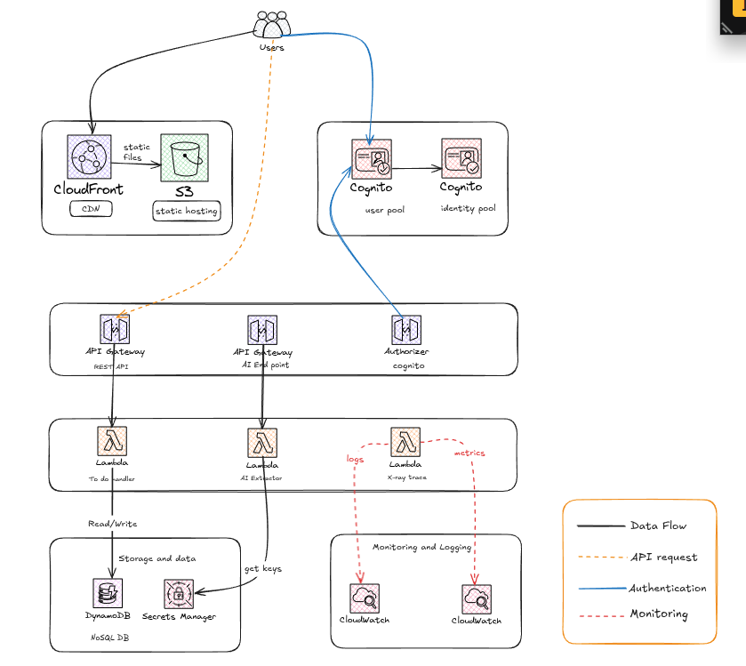

# Serverless Todo Application

[](https://opensource.org/licenses/MIT)

A comprehensive, serverless to-do web application built on AWS. This project serves as a practical demonstration of modern cloud architecture, infrastructure as code, and DevOps principles. It is a fully functional, scalable, and secure to-do management system, designed to be cost-effective by operating entirely within the AWS Free Tier.



## 🚀 Live Demo

[Link to your deployed application]

## ✨ Features

*   **Secure User Management**: Robust user authentication and authorization powered by Amazon Cognito, featuring secure sign-up, sign-in, and sign-out.
*   **Complete CRUD Functionality**: Full support for Creating, Reading, Updating, and Deleting (CRUD) to-do items.
*   **Responsive & Modern UI**: A sleek, mobile-friendly, and responsive user interface built with React and Tailwind CSS.
*   **Scalable Serverless Backend**: A highly scalable and resilient backend built with AWS Lambda and Amazon API Gateway.
*   **Automated Cloud Provisioning**: The entire cloud infrastructure is managed through Terraform, enabling automated, consistent, and repeatable deployments.
*   **CI/CD Ready**: The project is structured to be easily integrated into a CI/CD pipeline for automated testing and deployment.

## 🏛️ Architecture

The application is built on a serverless architecture, leveraging a suite of powerful AWS services:

*   **Frontend**: A responsive single-page application (SPA) built with **React** and hosted on **AWS Amplify**.
*   **Authentication**: User authentication and authorization are managed by **Amazon Cognito**.
*   **Backend Logic**: **AWS Lambda** functions, written in Python, handle the application's business logic.
*   **API**: A RESTful API is exposed via **Amazon API Gateway**, connecting the frontend with the backend services.
*   **Database**: **Amazon DynamoDB** provides a scalable and flexible NoSQL database for storing to-do items.
*   **Infrastructure as Code (IaC)**: The entire infrastructure is defined and managed using **Terraform**, promoting automation and consistency.

## 💻 Technology Stack

| Category      | Technology                               |
|---------------|------------------------------------------|
| **Frontend**  | React, Tailwind CSS                      |
| **Backend**   | Python, AWS Lambda                       |
| **Database**  | Amazon DynamoDB                          |
| **API**       | Amazon API Gateway                       |
| **Auth**      | Amazon Cognito                           |
| **Hosting**   | AWS Amplify                              |
| **IaC**       | Terraform                                |

## 📁 Project Structure

```
.
├── frontend/         # React frontend application
├── terraform/        # Terraform configuration files
│   ├── lambda/       # Python source code for Lambda functions
│   └── ...
├── scripts/          # Deployment and utility scripts
├── README.md         # This file
└── ...
```

## 🏁 Getting Started

To get the application up and running in your own AWS account, follow these steps.

### Prerequisites

*   An AWS account with administrator privileges.
*   The [AWS CLI](https://aws.amazon.com/cli/) installed and configured.
*   [Terraform](https://www.terraform.io/downloads.html) installed on your local machine.
*   [Node.js and npm](https://nodejs.org/en/download/) installed on your local machine.

### Setup

The `setup.sh` script prepares your environment for deployment. It installs frontend dependencies, configures AWS credentials for Terraform, and initializes the Terraform workspace.

```bash
./setup.sh
```

### Deployment

The `deploy.sh` script deploys the entire application stack to your AWS account using Terraform.

```bash
./deploy.sh
```

Once the deployment is complete, the script will output the URL of the deployed frontend application.

### Cleanup

The `cleanup.sh` script will destroy all the AWS resources created by the deployment, preventing any further charges.

```bash
./cleanup.sh
```

## 🔧 Usage

Once the application is deployed, you can access it using the URL provided by the deployment script. You will be able to:

1.  Create a new user account.
2.  Log in with your newly created account.
3.  Add, view, update, and delete your to-do items.

## 🧪 Testing

The project includes a test plan located in `docs/test-plan.md`. To test the authentication flow, you can use the `test-auth.sh` script.

```bash
./test-auth.sh
```

## 🤝 Contributing

Contributions are welcome! Please feel free to submit a pull request or open an issue.

## 📄 License

This project is licensed under the MIT License. See the [LICENSE](LICENSE) file for more details.

## 📞 Contact

[Your Name] - [Your Email]

Project Link: [https://github.com/zahurul-islam/to_do_app](https://github.com/zahurul-islam/to_do_app)

## 💰 Cost Analysis

This project is designed to be cost-effective and, for the most part, operate within the AWS Free Tier for typical usage. However, it's important to understand the potential costs if usage exceeds the Free Tier limits.

| Service | Free Tier | Estimated Cost (Beyond Free Tier) | Notes |
| :--- | :--- | :--- | :--- |
| **AWS Lambda** | 1 million requests/month, 400,000 GB-seconds of compute time | $0.20 per 1M requests, $0.00001667 per GB-second | The cost is highly dependent on the number of requests and the execution time of the Lambda functions. |
| **Amazon API Gateway** | 1 million HTTP API calls/month | $1.00 per million calls | The cost is directly proportional to the number of API calls. |
| **Amazon DynamoDB** | 25 GB of storage, 25 WCUs, 25 RCUs | $0.25 per GB-month, $1.25 per WCU-month, $0.25 per RCU-month | Costs will increase with the amount of data stored and the number of read/write operations. |
| **Amazon Cognito** | 50,000 MAUs (monthly active users) | $0.0055 per MAU | Costs are based on the number of monthly active users. |
| **AWS Amplify** | 1,000 build minutes/month, 5 GB storage, 15 GB data transfer | $0.01 per build minute, $0.023 per GB stored, $0.15 per GB transferred | Costs are primarily driven by build times and data transfer. |
| **Amazon S3** | 5 GB of standard storage, 20,000 Get Requests, 2,000 Put Requests | $0.023 per GB-month (standard storage) | Used for hosting the frontend application. |
| **Amazon CloudFront** | 1 TB of data transfer out, 10,000,000 HTTP/HTTPS requests | $0.085 per GB for the first 10 TB | Used to distribute the frontend content globally. |
| **Amazon CloudWatch** | 10 custom metrics, 10 alarms, 1M API requests | $0.30 per metric/month, $0.10 per alarm/month | Used for monitoring, logging, and alarms. |
| **AWS Secrets Manager** | | $0.40 per secret per month | Used to store the Gemini and OpenAI API keys. |
| **Total Estimated Monthly Cost** | **~$0.00 (within Free Tier)** | **Variable (dependent on usage)** | |

**Note:** These are estimates and can vary based on your specific usage patterns and AWS region. It's recommended to set up AWS Budgets to monitor your costs and avoid unexpected charges.(https://github.com/your-username/your-repo)