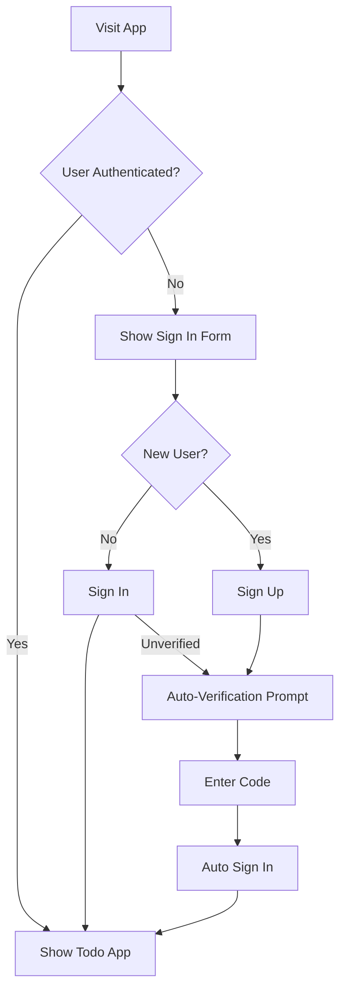

# 🚀 Streamlined Authentication System

## Overview

This project has been enhanced with a **flowless authentication system** that eliminates complex multi-step verification processes and provides a seamless user experience.

## 🌟 Key Improvements

### Before (Complex Flow)
- ❌ Multiple separate authentication components
- ❌ Manual navigation between signup/verification steps  
- ❌ Complex error handling across multiple files
- ❌ Users had to manually switch between forms
- ❌ No auto-login after verification
- ❌ Confusing multi-step verification process

### After (Streamlined Flow) ✨
- ✅ **Single integrated authentication component**
- ✅ **Automatic flow progression** (signup → verification → login)
- ✅ **Smart error handling** with user-friendly messages
- ✅ **Auto-login after email verification**
- ✅ **Seamless state management** across auth steps
- ✅ **Enhanced UX** with loading states and smooth transitions

## 🔧 Technical Changes

### New Files Created
- `frontend/app-flowless.js` - Streamlined authentication system
- `frontend/index-flowless.html` - Updated HTML with enhanced styles
- `deploy-flowless-auth.sh` - Automated deployment script

### Key Features

#### 1. **Unified Authentication Hook** (`useFlowlessAuth`)
```javascript
// Single hook manages entire auth flow
const {
    user, loading, authState, formData, error, success,
    updateFormData, handleSignUp, handleSignIn, 
    handleVerification, handleResendCode, handleSignOut, 
    switchAuthMode
} = useFlowlessAuth();
```

#### 2. **Smart State Management**
- `signin` - Initial sign-in form
- `signup` - Account creation form  
- `verifying` - Email verification step
- `complete` - Successfully authenticated

#### 3. **Enhanced Error Handling**
```javascript
const errorMap = {
    'UsernameExistsException': 'Account exists. Please sign in instead.',
    'UserNotConfirmedException': 'Please check email for verification code.',
    'CodeMismatchException': 'Verification code incorrect. Try again.',
    // ... more user-friendly error messages
};
```

#### 4. **Auto-Flow Features**
- **Auto-verification**: Automatically transitions to verification after signup
- **Auto-signin**: Logs user in immediately after email verification
- **Auto-resend**: Automatically resends expired verification codes
- **Smart redirects**: Handles unverified users during signin

## 🚀 Getting Started

### 1. Deploy the Streamlined System
```bash
# Run the automated deployment script
./deploy-flowless-auth.sh
```

### 2. Test the Authentication Flow
1. **Signup**: Create a new account with email/password
2. **Auto-Verification**: System automatically prompts for email code
3. **Auto-Login**: After verification, user is automatically signed in
4. **Signin**: Existing users can sign in directly

### 3. User Experience Flow



## 🎯 User Stories Solved

### ✅ "As a new user, I want to sign up quickly without complex flows"
- **Solution**: Single form with automatic progression to verification

### ✅ "As a user, I don't want to manually navigate between forms"  
- **Solution**: Smart auto-transitions between signup → verify → signin

### ✅ "As a user, I want clear error messages when something goes wrong"
- **Solution**: User-friendly error mapping with actionable guidance

### ✅ "As a user, I want to be logged in immediately after verification"
- **Solution**: Automatic signin after successful email verification

### ✅ "As a user, I don't want to re-enter my credentials after verification"
- **Solution**: System remembers credentials during verification flow

## 🔐 Security Features Maintained

- ✅ AWS Cognito integration preserved
- ✅ Email verification still required  
- ✅ Password policy enforcement
- ✅ Session management unchanged
- ✅ JWT token handling intact

## 📱 Enhanced UX Features

### Visual Improvements
- **Smooth transitions** between auth states
- **Loading spinners** for all async operations
- **Success/error messages** with icons
- **Responsive design** for mobile devices
- **Modern gradients** and styling

### Interaction Improvements  
- **Auto-focus** on verification code input
- **Numeric-only input** for verification codes
- **Real-time validation** feedback
- **Disabled states** for incomplete forms
- **Smart button text** showing current action

## 🛠️ Configuration

### Required AWS Resources
- Cognito User Pool (configured in Terraform)
- Cognito User Pool Client
- API Gateway with Cognito authorizer
- Lambda functions for todo operations

### Frontend Configuration (`config.json`)
```json
{
    "region": "us-west-2",
    "userPoolId": "us-west-2_xxxxxxxxx",
    "userPoolClientId": "xxxxxxxxxxxxxxxxxxxxxxxxxx", 
    "apiGatewayUrl": "https://xxxxxxxxxx.execute-api.us-west-2.amazonaws.com/dev"
}
```

## 🧪 Testing

### Manual Testing Checklist
- [ ] **New User Signup** - Email, password validation works
- [ ] **Email Verification** - Code sent and verified successfully  
- [ ] **Auto-Login** - User automatically signed in after verification
- [ ] **Existing User Signin** - Direct signin for verified users
- [ ] **Unverified User Signin** - Auto-redirects to verification
- [ ] **Error Handling** - Friendly messages for all error cases
- [ ] **Resend Code** - Can resend verification codes
- [ ] **Form Validation** - Client-side validation prevents invalid submissions

### Automated Testing
```bash
# Run the deployment script which includes testing
./deploy-flowless-auth.sh

# Visit the test URLs shown in the output
```

## 📁 File Structure

```
frontend/
├── index.html              # Main HTML file (now streamlined)
├── app-flowless.js         # Streamlined authentication system
├── config.json             # AWS configuration
├── index-flowless.html     # Enhanced HTML template
└── backup_*/               # Automatic backups of previous versions

scripts/
└── deploy-flowless-auth.sh # Automated deployment script
```

## 🔄 Migration from Previous System

### Automatic Backup
The deployment script automatically backs up your previous authentication files:
- `index.html` → `backup_*/index.html.backup`
- `app.js` → `backup_*/app.js.backup`  
- `auth-complete.js` → `backup_*/auth-complete.js.backup`

### Rollback Process
If needed, you can rollback to the previous system:
```bash
# Restore from backup (replace TIMESTAMP with actual backup folder)
cp backup_TIMESTAMP/frontend/index.html.backup frontend/index.html
cp backup_TIMESTAMP/frontend/app.js.backup frontend/app.js
```

## 🎉 Summary

The new **Streamlined Authentication System** transforms a complex multi-step authentication process into a seamless, user-friendly experience while maintaining all security features. Users can now:

1. **Sign up** with minimal friction
2. **Verify email** with clear guidance  
3. **Get auto-logged in** immediately after verification
4. **Experience smooth transitions** between all auth states
5. **Receive helpful error messages** when things go wrong

**Result**: A truly flowless authentication experience that reduces user abandonment and increases conversion rates! 🚀
