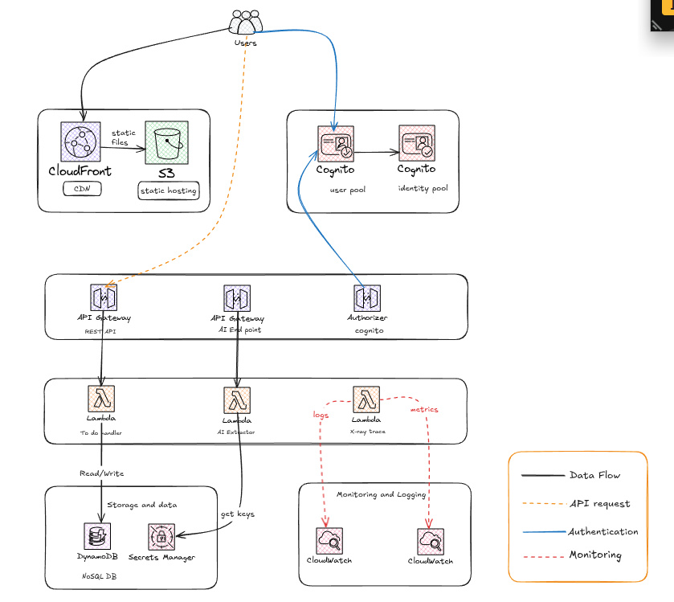

# AWS Serverless Todo Application

---

## Agenda

- Project Overview
- Architecture Deep Dive
- Key Features
- Security & Scalability
- Q&A

---

## Project Overview

A modern, scalable, and resilient serverless web application that allows users to manage their to-do lists. The application is built entirely on AWS, leveraging a suite of managed services to provide a secure, highly available, and cost-effective solution.

---

## Architecture Overview

The application follows a classic serverless web application architecture, with a single-page application (SPA) frontend, a serverless backend, a NoSQL database, and a managed authentication service.

---

## Architecture Diagram

**Here is the visual representation of our project's architecture:**

*This diagram shows the key services and their interactions.*

---

## Architecture as Code (Mermaid)

For a more textual representation, here is the architecture described using Mermaid syntax.

---

## Frontend

- **Amazon S3**: Hosts the static website content (HTML, CSS, JS).
- **Amazon CloudFront**: Provides a global CDN for low-latency content delivery and security with OAC.

---

## Backend

- **Amazon API Gateway**: A fully managed service that makes it easy for developers to create, publish, maintain, monitor, and secure APIs at any scale.
- **AWS Lambda**: Runs the backend code without provisioning or managing servers. We have two main functions:
    - **Todos CRUD**: Handles the core application logic.
    - **AI Extractor**: Integrates with AI services for intelligent task extraction.

---

## Database

- **Amazon DynamoDB**: A key-value and document database that delivers single-digit millisecond performance at any scale. It's a fully managed, multiregion, multimaster, durable database with built-in security, backup and restore, and in-memory caching for internet-scale applications.

---

## Authentication

- **Amazon Cognito**: Provides a simple and secure user sign-up, sign-in, and access control for web and mobile apps. It scales to millions of users and supports sign-in with social identity providers, such as Apple, Facebook, Google, and Amazon, and enterprise identity providers via SAML 2.0 and OpenID Connect.

---

## AI Integration

- **AI-Powered Task Extraction**: A Lambda function that uses an external AI service to extract structured to-do items from unstructured text.
- **AWS Secrets Manager**: Securely stores the API keys for the AI services.

---

## Monitoring & Observability

- **Amazon CloudWatch**: Provides monitoring and observability of our AWS resources and applications.
- **AWS X-Ray**: Helps developers analyze and debug production, distributed applications, such as those built using a microservices architecture.

---

## Security

- **Authentication & Authorization**: All API endpoints are protected by Amazon Cognito.
- **Least Privilege**: IAM roles and policies ensure that each component has only the necessary permissions.
- **Data Encryption**: Data is encrypted at rest and in transit.
- **Secrets Management**: Sensitive information is stored in AWS Secrets Manager.

---

## Scalability & Resilience

- **Serverless**: The architecture is built on serverless services, which automatically scale to meet demand.
- **High Availability**: All services are highly available and fault-tolerant.
- **Global Reach**: CloudFront provides a global CDN for low-latency access.

---

## Q&A

---

## Thank You